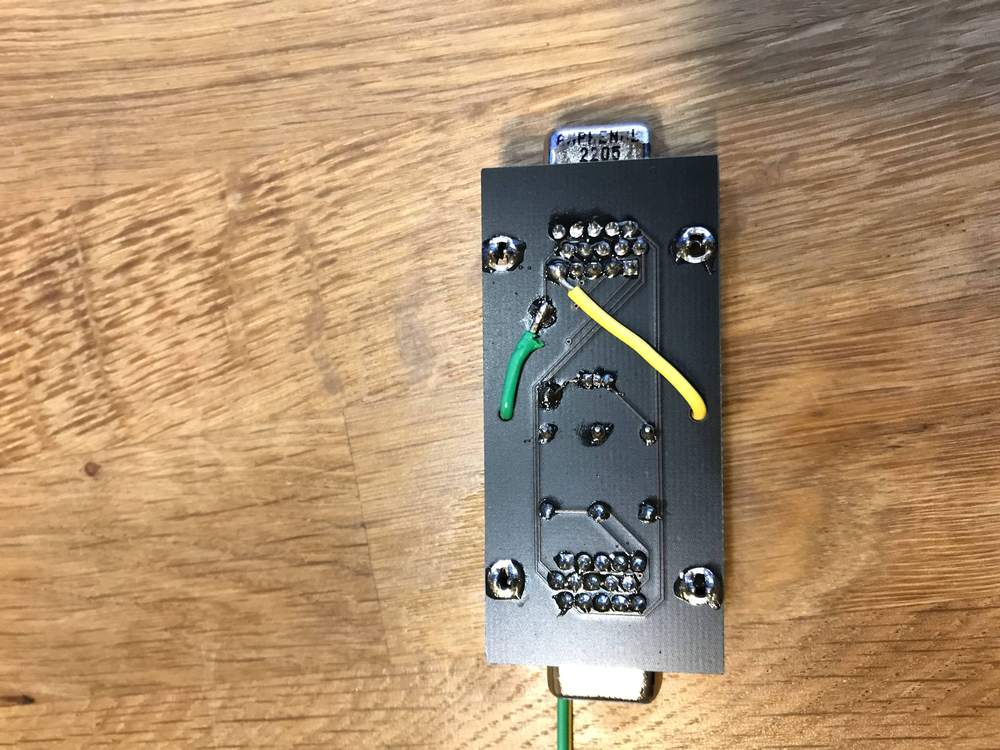

# UnityJVSLightgun
JVS light gun integration with Unity. This is a sample Unity game that will let you use a Namco TSS-IO based arcade light gun (found on Time Crisis 3 arcade machines) as input for creating your own Unity light gun games. This project requires a CRT TV/monitor and complicated hardware setup and is only a proof of concept. If you're serious about making a light gun Unity game I highly recommend using an IR based light gun.

https://user-images.githubusercontent.com/15973121/198228730-85bc7539-aee1-43eb-b9f0-6718294a34ed.MOV

# Unity Game
The Unity project is located in the 'Unity' directory and features a shooting range style demo. You can use the mouse or light gun as input, moving the mouse/light gun will move the on-screen crosshair, and pressing the left mouse button or pulling the light gun trigger will place a bullet hole on screen where the crosshair was aimed.

https://user-images.githubusercontent.com/15973121/198228819-577e982d-eb23-4147-8051-f0f33c27bdf9.mp4

## Required settings
In order to work with the Namco TSS-IO board the video output of the PC must be set to 15kHz 640x480i 30Hz (240p 60Hz would probably work as well but is untested). See the hardware setup section for additional details on how to do this. The Unity game can run at whatever resolution you want, though it's recommended to match the output video resolution of the PC for best results. It will also need to be capped to 30fps with vsync enabled to make sure frames are drawn on sync intervals or else the light gun may not be able to properly detect flash frames. These settings have already been configured in the Unity project as follows:
- Project Settings/Player/Resolution and Presentation/Default Screen Width/Height = 640x480
- Project Settings/Quality/VSync Count = Every V Blank
- In Assets/Scripts/PlayerController.cs the FPS is limited to 30

## Object hierarchy
The SampleScene in the Unity project contains a few different objects:

- MainCamera - Main camera for the scene
- FlashCamera - Flash frame camera, used as a workaround for not being able to arbitrary clear the backbuffer mid-frame
- Player - Represents the player, contains scripts for processing input, managing bullet holes, and playing gun audio
- BulletHole - Bullet hole instance object
- HUD - Placeholder object containing scripts that draw info on screen
- EventSystem\Canvas\Crosshair - UI system for displaying the crosshair on screen using screen coordinates

## PlayerController script
Controls player behavior such as checking for light gun input, handling recoil, drawing flash frames, and placing bullet holes on screen.

Properties:
- Crosshair Object - UI object for the crosshair (should be part of the EventSystem\Canvas object)
- Bullet Hole 1/2/3 - Bullet hole textures to be drawn for gun shots, chosen at random each time the gun is fired
- Main Camera - Main camera object
- Flash Frame Camera - Flash frame camera used for providing a light source to the light gun for hit detection
- Flash Frame Count - Number of frames the flash frame camera should stay active
- Bullet Life Time - Time in seconds for how long the bullet decals should stay on screen before fading
- Bullet Decay Time - Time in seconds it takes for bullets to fade away
- Gun Shot Sound - Sound to be played when the gun is fired

## Lightgun Controller script
Handles interfacing with the TSS-IO board to poll and update light gun state. This script will load JvsLightgunDll.dll, open the COM port specified, and initialize the light gun state. Because the serial adapter I used for this project is unable to poll at a fast enough rate I wrote an asynchronous polling routine in JvsLightgunDll that runs on its own thread in the background. Each frame of the game the light gun controller script will get the light state from JvsLightgunDll and update GPIO state. It is recommended to use the asynchronous polling APIs instead of the synchronous ones to avoid killing FPS on the game threads.

Properties:
- COM Port - COM port name for the RS-485 serial adapter, ex.: "COM3"
- Enabled - If checked uses the light gun for input, otherwise does not use light gun for input
- Gun Screen Offset - Calibration offset subtracted from light gun coordinates to correct for the screen being used
- Gun Screen Size - Size of the screen as seen by the TSS-IO board, this is most likely based on the timings of the sync signal fed to the IO board
- Gun Crosshair Offset - Offset applied to the crosshair object to center it for the gun's line of sight

# JvsLightgun Dll
The JvsLightgun directory contains the native code to talk to the TSS-IO board over a COM port. There are three projects in this directory:
- JvsLightgunDll - Dll that handles JVS communication and exposes APIs for querying device state
- JvsLightgun - Console application used to test light gun communication is working correctly
- CSharpTest - C# wrapper for the JvsLightgunDll project to test C# interop outside of Unity

# Hardware Setup
In order to use the TSS-IO board you will need to provide it a sync signal from your video feed, and connect it to a USB -> RS-485 adapter. The sync signal is used to determine where on the screen the gun was aimed when it detected light, and the RS-485 adapter is to communicate with the IO board from your PC. The hardware requirements and setup for both are described below.

You can refer to this pinout of the TSS-IO board for where to connect the sync signal and RS-485 lines.

## Video sync signal
The TSS-IO light gun IO board is designed to work with a 15kHz 640x480i 30Hz video signal. A 15kHz 240p 60Hz signal will most likely work as well since it's passing the same amount of information with the same timings as 480i but I have not tested this. To get a 15kHz video signal you will either need a scalar that can convert VGA (or whatever other video output you use) to a 15kHz signal, or a PC running [CRT EmuDriver](https://geedorah.com/eiusdemmodi/forum/viewtopic.php?id=295) with a compatible graphics card.

Once you have working video output from your PC you will need to split the sync signal off and feed it to the IO board. The TSS-IO board required composite sync, so if you're using CRT EmuDriver or a scalar that outputs RGBHV you will need a sync combiner to combine the horizontal and vertical sync signals before feeding it to the IO board. I used the [Mystic Prysm VGA Sync Combiner](https://mysticprysm.com/product/sync-combiner/) and it work great.

You will most likely need a powered VGA splitter in order to provide an adequate signal to both the CRT and the IO board. In my experience the signal output from my graphics card was not strong enough to feed both at the same time, and would cause the video feed to get garbled. I bought this [VGA splitter](https://www.amazon.com/dp/B017ELEEG8?psc=1&ref=ppx_yo2ov_dt_b_product_details) off Amazon and it worked great.

In my setup the CRT also required composite sync and I noticed that placing the sync combiner before the VGA splitter would cause the video feed to have a blue or purple tint to it. I "solved" this by splitting off composite sync from the video feed and only running sync through the VGA splitter (to re-amplify the signal going to the IO board). This provided an adequate signal to both the CRT and IO board without the blue/purple tint on the video feed.

To tap composite sync off the sync combiner you want to solder 2 wires to pins 5 and 13 on the output side of the sync combiner, pin 5 is GND and pin 13 is composite sync, these can be connected to VGND (6) and SYNC (7) on the IO PCB diagram.

## RS-485
For RS-485 you will need a USB -> RS-485 adapter, I purchased [this one](https://www.amazon.com/dp/B081MB6PN2?psc=1&ref=ppx_yo2ov_dt_b_product_details) off Amazon. It works but it can't poll fast enough to trigger the recoil solenoid as smoothly as I would like. To connect the IO board up to the RS-485 adapter simply connect GND (1), D+ (3), and D- (4) on the IO board to the A+, B-, and GND terminals on the RS-485 adapter. Some adapters will flip the A/B terminals so if you can't talk to the IO board try flipping the wires around.
